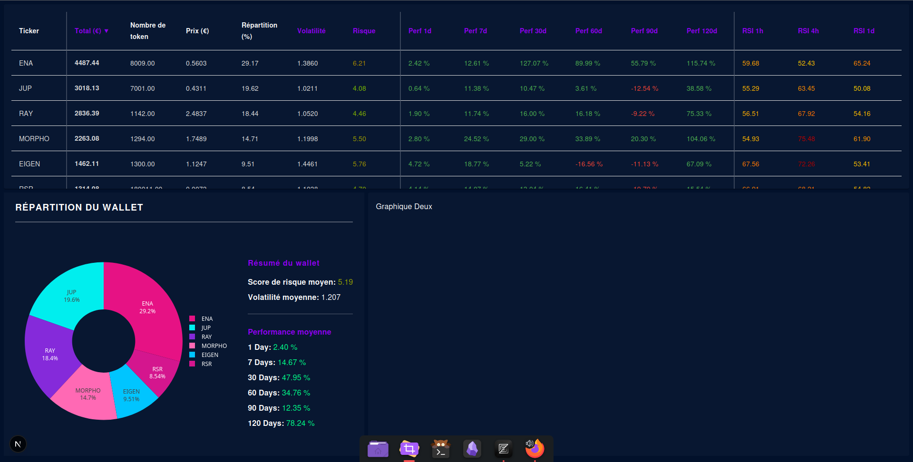

# quant-balance

## Overview



This application helps users **balance their crypto wallet** based on the **level of risk they are willing to take**. It provides a dashboard to visualize the current allocation, token metrics, and detailed risk indicators.

### Key Features

* Fetches real-time data for multiple cryptocurrencies using **CCXT**, a unified cryptocurrency trading library.
* Displays detailed metrics such as:
  * Token holdings
  * Price and total value
  * Risk score (from 1 to 10)
  * RSI (Relative Strength Index) indicators
  * Historical performance (1d, 7d, 30d, etc.)
  * Volatility
* Uses color-coded indicators to help quickly assess asset health (green = safer, red = riskier).
* Allows users to **rebalance** their portfolio dynamically according to calculated risks and allocations.
* Automatically refreshes data every 60 seconds for live updates.

### Technologies

* **Next.js** with **TypeScript** for the frontend
* **Material UI (MUI)** for the UI components
* **CCXT** for connecting to crypto exchanges and fetching market data
* Backend server (assumed to be Python-based) to expose a REST API for crypto data

---

## Installation

```bash
cd backend
python -m venv venv && source venv/bin/activate
pip install -r requirements.txt
```

```bash
cd frontend
npm install
```

---

## Frontend

```bash
npm run dev
```

Libraries for graphs : https://plotly.com/javascript/

---

## Backend

```bash
uvicorn main:app --reload
```

##### Test the API: http://127.0.0.1:8000/crypto_data?symbol=ENA

---

### How the risk score is calculated

Here is a simple equation summarizing your risk calculation:

$$
\text{Risk Score} = 10 \times \text{clamp}\Big(0.5 \times \frac{\text{volatility}}{2} + 0.07 \times \text{scaleRSI}(rsi_{1h}) + 0.09 \times \text{scaleRSI}(rsi_{4h}) + 0.07 \times \text{scaleRSI}(rsi_{1d}) + 0.07 \times \text{scalePerf}(perf_{1d},20) + 0.09 \times \text{scalePerf}(perf_{7d},50) + 0.07 \times \text{scalePerf}(perf_{30d},100) + 0.06 \times \text{scalePerf}(perf_{90d},100) + 0.03 \times \text{scalePerf}(perf_{120d},100), 1, 1\Big)
$$

where:

* $\text{clamp}(x,a,b) = \min(b, \max(a,x))$,
* $\text{scaleRSI}(r) = 0.01 + 0.98 \times \text{clamp}\left(\frac{r-30}{60},0,1\right)$,
* $\text{scalePerf}(p,s) = \text{clamp}\left(\frac{|p|}{s},0,1\right)$.

signification of the parameters:

* **clamp(x, a, b)**: restricts the value `x` to stay within the range `[a, b]`. For example, clamp(1.2, 0, 1) = 1.
* **scaleRSI(r)**: transforms an RSI (Relative Strength Index) value between 30 and 90 into a score between 0.01 and 0.99. Higher RSI gives a higher score.
* **scalePerf(p, s)**: converts a performance percentage `p` into a score between 0 and 1 by dividing by a scale `s` (like 20, 50, 100) and clamping the result.

This produces a risk score between 1 and 10.
